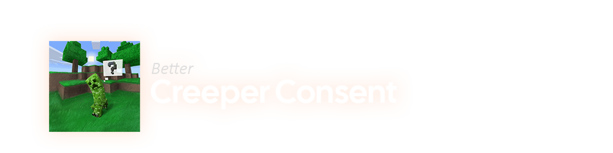

# Creeper Consent: Original

**The original Creeper Consent mod, made by Sectorfive.**  

    

---

    

## The future of this mod
The original creator, Sectorfive has abandoned this project, and as of now I'll be taking care of the mod, for the foreseeable future.

I don't really plan on adding new features; my main and only goal is to preserve and keep updating this mod to the newer versions.

 

### Everything below this line has been copied from the original README

---

## About

A mod that changes creeper behavior, making them ask a player for consent before exploding.

## Installation

1. Download the latest version of Fabric.
2. Download the mod file from the releases section on GitLab.
3. Place the mod file in the `mods` folder in your Minecraft Fabric installation directory.
4. Launch Minecraft with the appropriate Fabric profile.
5. It should now work :3

## License

This project is licensed under the **Mulan Public License, Version 2 (MulanPubL-2.0)**.
You may obtain a copy of the License at:
http://license.coscl.org.cn/MulanPubL-2.0

## Contributing

I originally created this mod after watching a YouTube video and reading the comments under it, especially the ones quoting Micro$oft/Mojang’s line: "Nothing bad will happen to a player unless it’s directly caused by them."

Since then, I’ve noticed a lot of interest and support for the mod, especially on Reddit, where many people wanted to see it continue. Because I don’t have much time to maintain it regularly, contributions are more than welcome!

If you’d like to add new features or fix existing issues, feel free to fork the project and submit your changes. I’ll gladly accept most contributions, as long as they work properly.

There are no strict rules about what can or can’t be added, so don’t hesitate to experiment and have fun with it.

## Features

1. Creeper Consent
2. Multiple languages (users need to contribute translations in form of json files)
4. Singleplayer and Multiplayer Support